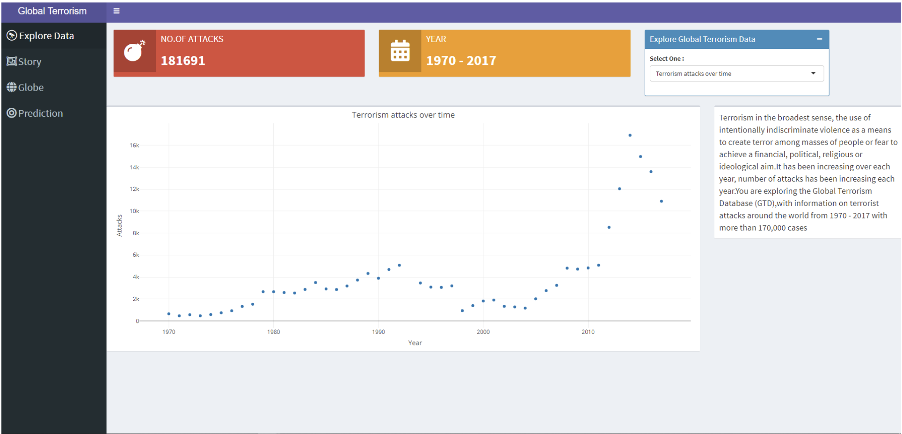
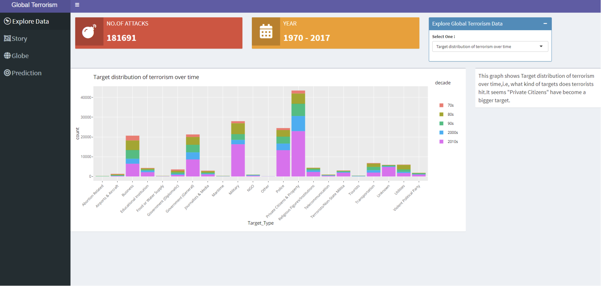
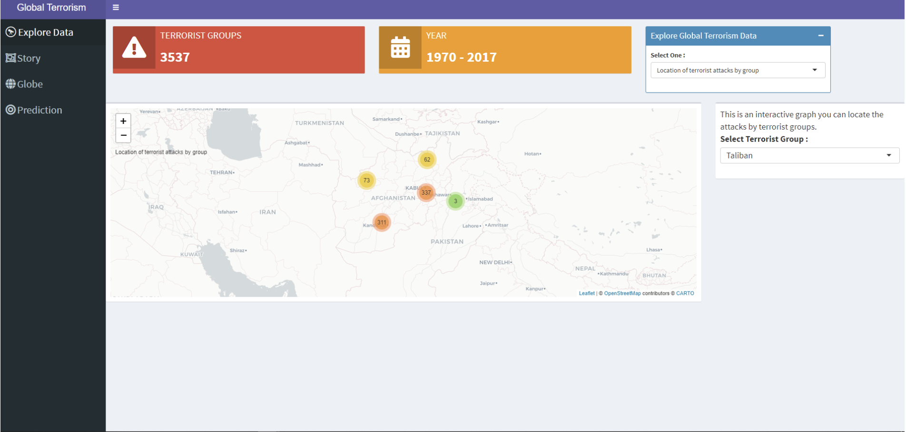
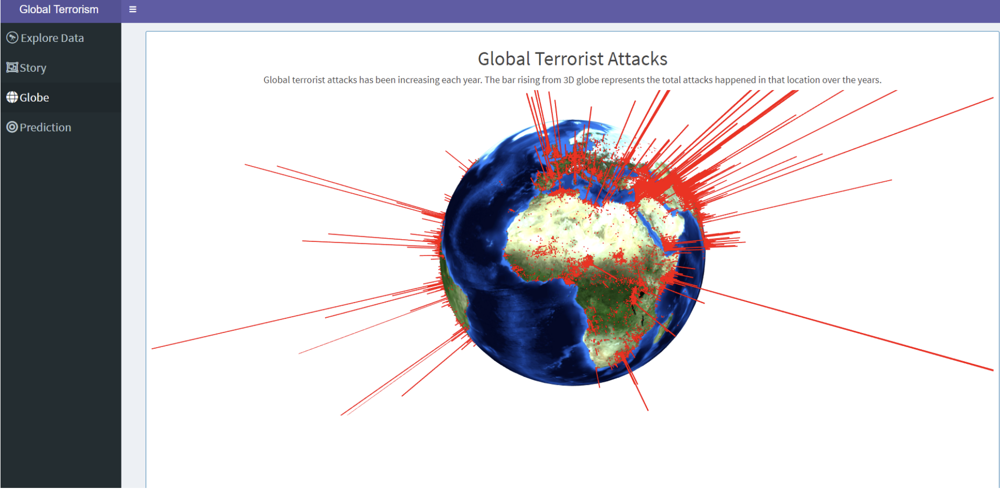

# Shiny-App-for-Terrorism-Data-Analysis-and-Visualization

## Description
The Terrorism Data Analysis project aims to provide an in-depth analysis of terrorism activities globally. This project encompasses various stages including data processing, exploratory data analysis (EDA), application of machine learning algorithms, and data visualization, all orchestrated to provide critical insights into the patterns and underlying factors associated with terrorism globally.

Dataset : [Kaggle - Global Terrorism Database](https://www.kaggle.com/datasets/START-UMD/gtd)

The Global Terrorism Database (GTD) is an open-source database including information on terrorist attacks around the world from 1970 through 2017. The GTD includes systematic data on domestic as well as international terrorist incidents that have occurred during this time period and now includes more than 180,000 attacks. The database is maintained by researchers at the National Consortium for the Study of Terrorism and Responses to Terrorism (START), headquartered at the University of Maryland.

#### Table of Contents
1. [Objective](#objective)
2. [Data Processing](#data-processing)
3. [Exploratory Data Analysis (EDA)](#exploratory-data-analysis-(EDA))
4. [Machine Learning Algorithms](#machine-learning-algorithms)
5. [Visualization](#visualization)
6. [Conclusion](#conclusion)
7. [Shiny Application](#shiny-application)
8. [Installation](#installation)
9. [Usage](#usage)

## Objective
The primary objective of this initiative is to dissect the complex landscape of global terrorism through data-driven analysis. By scrutinizing the historical data, we aspire to uncover potential trends, high-risk zones, prevalent methods of attacks, and possibly predict future incidents. Our analysis seeks to be a valuable resource for policy makers, security agencies, and researchers in understanding and devising strategies to counteract terrorism.

## Data Processing
In this phase, we engage in meticulous data cleaning and pre-processing to facilitate the subsequent analytical processes. We handle missing values, remove duplicates, and conduct type conversions to ensure the data is primed for analysis. Additionally, feature engineering is undertaken to create new variables that can potentially unveil deeper insights into the dynamics of terrorism.

## Exploratory Data Analysis (EDA)
The EDA phase is pivotal in understanding the data at hand. Through descriptive statistics and data visualization, we explore the underlying patterns and trends in the data. This step helps in identifying the key variables that influence the frequency and impact of terrorist attacks, fostering a deeper understanding of the global terrorism landscape.

## Machine Learning Algorithms
At this juncture, we leverage various machine learning algorithms to build predictive models. These models are trained using historical data to predict potential future incidents. Algorithms such as decision trees, random forests, and logistic regression are utilized in this phase. The models undergo rigorous testing and validation to ensure their accuracy and reliability.

## Visualization
Visualization forms a critical part of our project, where we employ various tools and techniques to graphically represent data. Through interactive dashboards and graphs, we aim to provide a visual narrative that complements the analytical findings, facilitating an easier interpretation of complex data patterns and trends.

## Conclusion
In the conclusion, we will encapsulate the findings and insights garnered through the project, emphasizing the value and potential impact it can have in understanding and mitigating the threats of terrorism globally.

## Shiny Application

## Installation
This section will detail the steps and requirements necessary for installing and setting up the project in a local environment. It will include information on the necessary software, libraries, and tools needed to run the project successfully.

## Usage
Here, we provide comprehensive documentation on how to use the project, including examples and tutorials to help users navigate through the project and understand its functionalities effectively.

